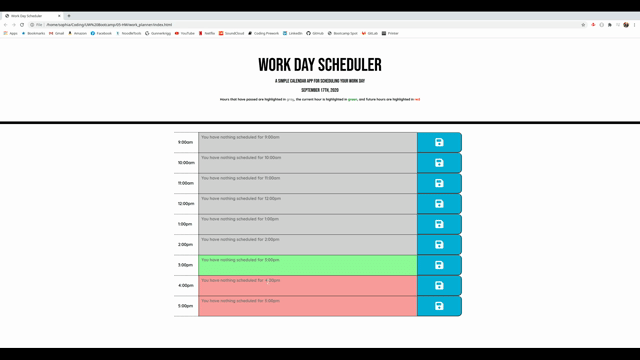
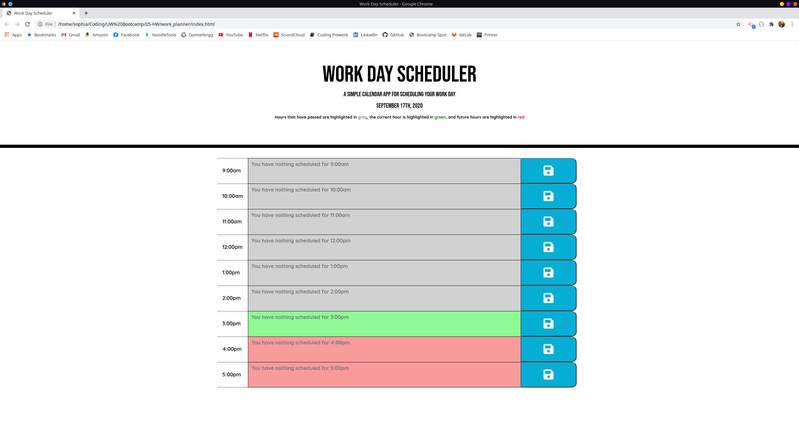
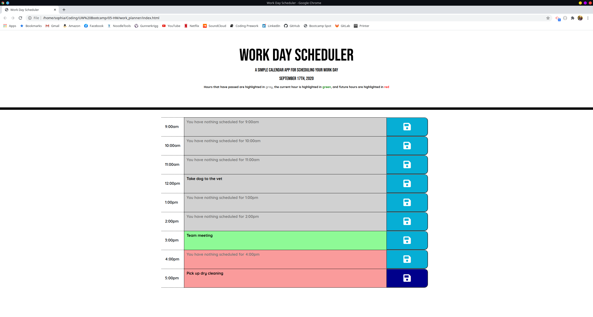

# Work Schedular

## Description

This repository consists of an HTML, Javascript, and two CSS files. One CSS file is a reset file to reduce browser inconsistencies and the other is the style sheet linked to the HTML. 

This page holds a work schedular/planner. It shows the schedule for the local current day, which is comprised of hourly blocks from 9AM-5PM (the standard workday). The user can click on the designated box for the desired hour and type in their appointments for that hour block. Then they must click on the save button, to save the content to local storage and preserve it through page refreshes. Additionally, each of the hourly blocks are color coded with one of the following three colors - gray to designate the hour has passed, green to designate the current local hour, and red to designate future hours. 

This project focuses on the usage of localStorage, DOM manipulation, Moment.js, and jQuery. Moment.js is a JavaScript library that assists with functionalities associated with time. 

## Access and Installation 

This project can be accessed either via the GitHub Repository page or the deployed public page. 

- [GitHub Repository](https://github.com/sophia2798/API_quiz)
- [Deployed Page](https://sophia2798.github.io/work_planner/)

To open and edit code files, you will need a text editor. The one used to create this page was Visual Studio Code (https://code.visualstudio.com/).

To install this repository, you can git clone the repository using the green "Code" button. You can copy and paste either the HTML or SSH URL.

## Usage

This project can be used as a daily workday planner, to store appointments between the hours of 9AM-5PM. It is limited, however, in that it does not allow for further planning and/or storage for future days. Creating that functionality could be a good addition to the existing code. 

This project can also be used as a template to learn more about accessing and saving information to localStorage. It also providdes examples as to how to manipulate that information along with time/date information from Moment.js using jQuery techniques. 

## Features 

- A set of hourly blocks, one for each hour between 9AM-5PM. Each block is color coded according whether it is before, during, or after the current local time. 

- The ability to input appointment information in the desired hourly block 

- A save button to save the entered appointment information to localStorage for continual referencing even as the page is refreshed or closed/reopened. 

## Authors

- Sophia Jung - [GitHub Profile](https://github.com/sophia2798)
- UW Coding Bootcamp/Trinity Education Services

## Credits

- [W3 Schools](https://www.w3schools.com/default.asp) 

- [Stack Overflow](https://stackoverflow.com/)

- [Moment.js](https://momentjs.com/)